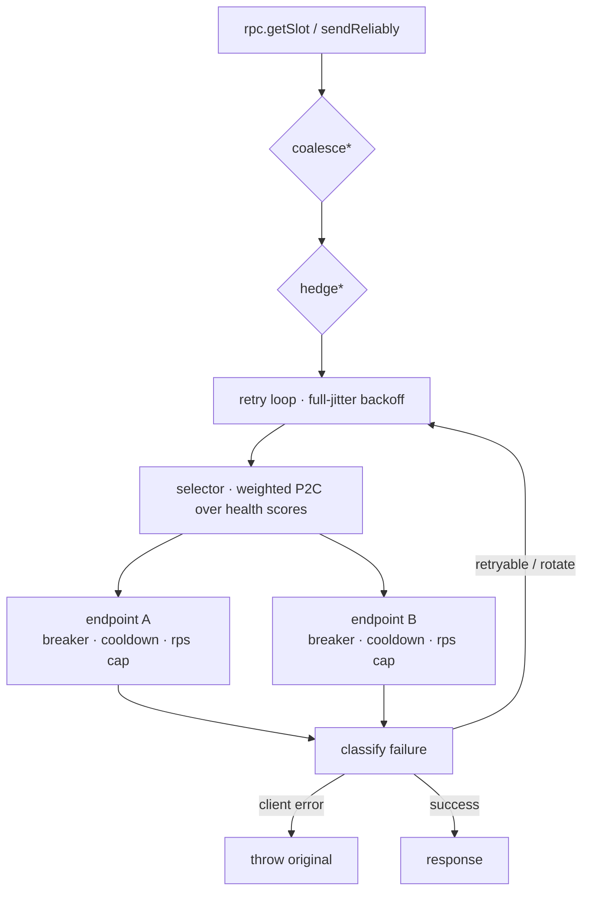

# solana-shield 🛡

**Systems-grade RPC and transaction reliability SDK for Solana dApps**, built on [`@solana/kit`](https://github.com/anza-xyz/kit) (the successor to web3.js, formerly web3.js v2).

Solana dApps fail in production for boring reasons: an RPC provider has a bad day, a free tier rate-limits you, a node falls behind the cluster, a transaction is dropped during congestion. solana-shield wraps your whole RPC + transaction layer in a resilience stack that handles all of it — and ships the chaos-testing rig to prove it.

```
 your dApp ──► createShield()
                 ├── rpc                    drop-in kit Rpc, resilient
                 ├── sendReliably()         Jito → RPC fallback, fees, rebroadcast, confirm
                 ├── health / metrics       live endpoint scoring, OpenTelemetry export
                 └── solana-shield CLI      doctor · monitor · bench · tx · fees
```

## Features

- **Resilient transport** — retries with full-jitter backoff, per-endpoint circuit breakers, health-scored power-of-two-choices load balancing, 429/`Retry-After` cooldowns, slot-lag probing, optional hedged reads and request coalescing. All composed as plain functions over kit's `RpcTransport` — use the whole stack or any piece.
- **MEV-protected sends** — route transactions through [Jito block engines](https://docs.jito.wtf/) (regional failover, live tip-floor tracking, 1 rps rate compliance, bundles API) with automatic fallback to regular RPC.
- **Dynamic fee oracle** — races Helius `getPriorityFeeEstimate`, QuickNode `qn_estimatePriorityFees`, Triton percentile fees, and native `getRecentPrioritizationFees` inside a 400ms budget; aggregates max-of-sources with a hard ceiling so a misbehaving source can never drain you.
- **Reliable transaction pipeline** — simulation-based compute budgets, WS + polling confirmation race, identical-bytes rebroadcast every 2.5s, exact blockhash-expiry detection. Never silently re-signs.
- **Durable-nonce mode — transactions that survive blockhash expiry entirely.** Opt into `sendReliably({ durableNonce })` and the tx pins its lifetime to a nonce account instead of a ~60s blockhash: it stays landable through arbitrary congestion until it confirms or you cancel. Pairs with **safe fee escalation** (`feeEscalation`) — each rebroadcast re-signs at a higher priority fee, and because every attempt shares the nonce, the first to land invalidates the rest, so it can never double-execute (which naive blockhash fee-bumping risks).
- **Wallet-standard adapter** — dependency-free discovery + a signer bridge that prefers `solana:signTransaction` (the wallet only signs, so shield keeps the bytes → wallet users still get Jito routing *and* rebroadcast), falling back to `solana:signAndSendTransaction`. Works with Phantom, Solflare, and any wallet-standard wallet; `@solana/react` signers work directly.
- **Observability** — zero-dep in-process metrics, mirrored to OpenTelemetry (→ Datadog, Grafana, anything OTLP) when `@opentelemetry/api` is installed.
- **React hooks** — `solana-shield/react` ships `useShield`, `useSendReliably` (live `building → … → confirmed` status for your UI) and `useEndpointHealth`. Optional peer dep; the core stays framework-agnostic.
- **One-line preset** — `createRecommendedShield(endpoints)` returns a fully-composed, sensibly-defaulted client (retry + failover + hedging + coalescing) for everyone who doesn't want to hand-compose middleware.
- **Actionable errors** — failures don't surface as raw RPC noise: `AllEndpointsFailedError` carries every classified cause *and* a remediation hint ("every endpoint is rate-limiting — add endpoints, set an rps cap, or raise your tier").
- **Chaos engineering, shipped** — `solana-shield/chaos` injects drops, latency distributions, 429 storms, flapping outages, and slow-loris hangs into any transport, deterministically seeded. It's how this SDK reaches >90% test coverage, and how you can test *your* dApp.

## Install

```bash
npm install solana-shield @solana/kit
```

## Quickstart

```ts
import { createShield, transferInstruction } from 'solana-shield';

const shield = createShield({
  endpoints: [
    'https://mainnet.helius-rpc.com/?api-key=KEY',   // provider auto-detected → fee API used
    { url: 'https://my-backup.example.com', weight: 2, rps: 10 },
    'mainnet',                                        // monikers work too
  ],
  jito: { regions: ['frankfurt', 'amsterdam'] },      // omit for RPC-only routing
});

// …or the easy button — sensible defaults (retry + failover + hedging + coalescing):
// import { createRecommendedShield } from 'solana-shield';
// const shield = createRecommendedShield(['https://rpc1...', 'https://rpc2...']);

// 1. A drop-in, resilient kit RPC — use it anywhere an Rpc is expected
const slot = await shield.rpc.getSlot().send();

// 2. Reliable sends with a live event stream
const handle = shield.sendReliably({
  instructions: [transferInstruction(payer.address, recipient, 1_000_000n)],
  signer: payer, // a keypair signer, or a wallet signer (see Wallets below)
});

for await (const event of handle) console.log(event.type, event);
// building → feeEstimated → signed → sent(via jito) → confirmed

const { signature, slot: landedSlot } = await handle.result;
```

`handle.result` rejects with `TxExpiredError` (blockhash lifetime ended — safe to rebuild) or `TxFailedError` (landed but failed on chain). The pipeline **never** rebuilds and re-signs behind your back.

### Migrating from vanilla kit

```ts
// before
import { createSolanaRpc } from '@solana/kit';
const rpc = createSolanaRpc('https://api.mainnet-beta.solana.com');

// after — same Rpc type, every call now retried/balanced/breakered
import { createShield } from 'solana-shield';
const { rpc } = createShield({ endpoints: ['https://rpc1...', 'https://rpc2...'] });
```

### Routing policies

| `route` | Behavior |
|---|---|
| `'auto'` (default) | Jito first when configured, automatic RPC fallback with a `jitoFallback` event |
| `'jito'` | Strict: failures surface, a frontrun-protected send is **never** silently downgraded to public RPC |
| `'rpc'` | Never touches Jito |

### Surviving congestion: durable nonce + fee escalation

For transactions that *must* land through a congestion storm, pin the lifetime to
a [durable nonce account](https://solana.com/developers/courses/offline-transactions/durable-nonces)
instead of a blockhash — it never expires:

```ts
const handle = shield.sendReliably({
  instructions,
  signer,                                   // keypair-style; must be the nonce authority
  durableNonce: { account: myNonceAccount }, // nonce value auto-fetched if omitted
  feeEscalation: { factor: 1.5, maxMultiplier: 5 }, // bump the fee each rebroadcast
});
```

It rebroadcasts (climbing the priority fee) until the tx confirms or you abort —
no `TxExpiredError`. Fee escalation is **only** enabled in durable-nonce mode,
where it's safe: every attempt shares the nonce, so the first to land advances it
and invalidates the rest (escalating a blockhash tx would risk double-execution,
so it's intentionally disabled there).

### Composing the transport yourself

Everything is a function over kit's `RpcTransport`, so you can assemble your own stack and hand it to kit directly:

```ts
import { createSolanaRpcFromTransport, createDefaultRpcTransport } from '@solana/kit';
import {
  createResilientTransport, composeTransport,
  createHedgingMiddleware, createCoalescingMiddleware,
} from 'solana-shield/transport';

const { transport, health } = createResilientTransport({
  endpoints: urls.map((url, i) => ({ id: `rpc-${i}`, url, transport: createDefaultRpcTransport({ url }) })),
});
const rpc = createSolanaRpcFromTransport(
  composeTransport(transport, createCoalescingMiddleware(), createHedgingMiddleware({ delayMs: 200 })),
);
```

Retry, circuit breaking, and load balancing live *inside* `createResilientTransport` rather than as standalone wrappers — deliberately: the breaker is per-endpoint and retries must re-run endpoint selection, which requires shared endpoint identity that independent flat wrappers can't see.

### Wallets (Phantom & friends)

```ts
import { watchWallets, createSignerFromWalletAccount } from 'solana-shield/wallet';

watchWallets(wallets => {
  const phantom = wallets.find(w => w.name === 'Phantom');
  // after wallet.features['standard:connect'].connect():
  const signer = createSignerFromWalletAccount(phantom, account);
  shield.sendReliably({ instructions, signer }); // wallet signs; shield routes, sends & confirms
});
```

React apps already on `@solana/react` need zero glue — pass the signer from
`useWalletAccountTransactionSendingSigner()` straight into `sendReliably`.
See [`examples/react-phantom`](examples/react-phantom) for a complete Vite app.

The bridge picks the **best wallet feature automatically**:

- `solana:signTransaction` → the wallet *only signs*; solana-shield keeps the
  signed bytes, so wallet users get full Jito routing **and** rebroadcast.
- `solana:signAndSendTransaction` (fallback) → the wallet signs and submits
  itself; the route degrades to RPC with an explicit `jitoFallback` event,
  and solana-shield still owns confirmation, expiry tracking, and events.

Coming from legacy `@solana/web3.js` 1.x objects (`PublicKey`,
`VersionedTransaction`)? Use [`@solana/compat`](https://www.npmjs.com/package/@solana/compat)
to convert to kit types at the boundary — everything here speaks kit.

## React

```tsx
import { useShield, useSendReliably, useEndpointHealth } from 'solana-shield/react';

function Pay({ signer, instructions }) {
  const shield = useShield({ endpoints: ['https://rpc1...', 'https://rpc2...'] });
  const tx = useSendReliably(shield);
  const health = useEndpointHealth(shield); // live per-endpoint snapshots

  return (
    <>
      <button disabled={tx.isPending} onClick={() => tx.send({ instructions, signer })}>
        {tx.isPending ? tx.status : 'Send'}   {/* building → signed → sent → confirmed */}
      </button>
      {tx.result && <p>✅ {tx.result.signature} in slot {String(tx.result.slot)}</p>}
      {tx.error != null && <p>❌ {String(tx.error)}</p>}
      <ul>{health.map(h => <li key={h.id}>{h.label}: {h.score.toFixed(2)}</li>)}</ul>
    </>
  );
}
```

`react` is an optional peer dependency — installing solana-shield doesn't pull React into non-React apps. The hooks are thin wrappers over the same `sendReliably` event stream and `health` snapshots the rest of the SDK exposes.

## Chaos testing your dApp

```ts
import { createChaosTransport, scenarios } from 'solana-shield/chaos';
import { createDefaultRpcTransport } from '@solana/kit';

const hostile = createChaosTransport(
  createDefaultRpcTransport({ url: 'https://api.devnet.solana.com' }),
  { ...scenarios.degradedProvider, seed: 42 },   // deterministic: same seed, same faults
);
// Hand `hostile` to createShield via transportFactory, or to kit directly —
// then watch your app survive drops, 502s, 429 storms, and slow-loris hangs.
```

Presets: `degradedProvider`, `rateLimitStorm`, `laggingNode`, `regionalOutage`, `recoveringPartition`, `slowLoris`. Full `FaultPlan` control: latency distributions (fixed/normal/pareto), per-method JSON-RPC errors, phased schedules.

## Observability (OpenTelemetry / Datadog)

```ts
import { enableOpenTelemetry } from 'solana-shield/telemetry';
await enableOpenTelemetry(shield.metrics); // no-op if @opentelemetry/api absent
```

Wire any OTLP backend in your app (Datadog Agent example):

```ts
import { NodeSDK } from '@opentelemetry/sdk-node';
import { OTLPMetricExporter } from '@opentelemetry/exporter-metrics-otlp-http';
import { PeriodicExportingMetricReader } from '@opentelemetry/sdk-metrics';

new NodeSDK({
  metricReader: new PeriodicExportingMetricReader({
    exporter: new OTLPMetricExporter({ url: 'http://localhost:4318/v1/metrics' }),
  }),
}).start();
```

Exported metrics: `solana_shield.rpc.request.duration|count` (per endpoint/method/outcome/failure-kind), `endpoint.health_score`, `endpoint.slot_lag`, `tx.confirmation.duration`, `tx.outcome`, `fees.source.duration`, `jito.tip_lamports`, and more.

Runnable demo: [`examples/otel-console.ts`](examples/otel-console.ts) prints these live to an OpenTelemetry console exporter — swap `ConsoleMetricExporter` for the OTLP one above to ship to Datadog/Grafana.

## Diagnostics CLI

```bash
npx solana-shield doctor    --endpoints "https://rpc1...,https://rpc2..."
npx solana-shield monitor   --methods          # live health table @1Hz
npx solana-shield bench     -n 100             # per-endpoint latency/throughput
npx solana-shield tx <signature> --watch
npx solana-shield fees      --level high
```

`doctor` checks reachability, node versions, WebSocket connectivity, fee sources, the Jito tip floor — and runs a **provider-agreement check** (slot consensus across your pool) that catches stale nodes that pass naive health checks. Exit code 0/1 + `--json` make it CI-friendly.

```
# Endpoints
ENDPOINT                REACHABLE  VERSION       LATENCY  SLOT LAG  AGREES  WS  NOTES
api.devnet.solana.com   yes        4.1.0-beta.1  271ms    0         yes     ok  -
backup.example.com      yes        4.1.0-beta.1  451ms    84        NO      ok  -
```

Config resolution: `--endpoints` flag → `--config file` → `./solana-shield.config.json` → `SOLANA_SHIELD_ENDPOINTS` env.

## How the resilience works


<sub>*opt-in middlewares</sub>

Every failure normalizes through one classification table (`network / timeout / HTTP / JSON-RPC node-health`) that decides: retryable? endpoint's fault? cooldown? dead (bad API key)? Health scores weight **success rate cubed** over latency and slot lag (reliability beats raw speed — methodology borrowed from Chainstack's public RPC benchmarks), and a total outage can never deadlock: the selector force-half-opens the best breaker so recovery is always probed.

## Using with gill

[gill](https://github.com/gillsdk/gill) users: solana-shield's `rpc`/`rpcSubscriptions`/`transport` are standard kit objects, so they compose directly:

```ts
import { sendAndConfirmTransactionFactory } from 'gill';
const sendAndConfirm = sendAndConfirmTransactionFactory({
  rpc: shield.rpc,
  rpcSubscriptions: shield.rpcSubscriptions[0],
});
```

## Examples

Runnable against devnet, a local `solana-test-validator`, or [Surfpool](https://surfpool.run):

- [`examples/node-send.ts`](examples/node-send.ts) — headless send through the full pipeline, streaming every lifecycle event. Cluster-agnostic:
  ```bash
  SHIELD_ENDPOINTS=localnet npx tsx examples/node-send.ts   # vs. Surfpool / local validator
  ```
- [`examples/react-phantom`](examples/react-phantom) — Vite + Phantom dApp: connect, send, watch the live transaction lifecycle and endpoint-health table.
- [`examples/otel-console.ts`](examples/otel-console.ts) — exports live RPC metrics to OpenTelemetry (console exporter; OTLP for Datadog/Grafana).

## Testing

```bash
pnpm test              # 323 tests
pnpm test:coverage     # enforces ≥90% lines/branches/functions/statements
```

The suite runs entirely without sockets: every component is a function over `RpcTransport`, tested against scriptable mocks and the shipped ChaosTransport with seeded PRNGs — deterministic, never flaky. Named resilience scenarios:

| Scenario | Test |
|---|---|
| One provider degraded (70% drops + 502s) → 60/60 requests still succeed, traffic shifts | [`test/scenarios/resilience.test.ts`](test/scenarios/resilience.test.ts) |
| Rate-limit storm with `Retry-After` → cooldown honored, zero requests wasted on the throttled node | [`test/scenarios/resilience.test.ts`](test/scenarios/resilience.test.ts) |
| Total partition → breakers open → network heals → recovery without deadlock | [`test/scenarios/resilience.test.ts`](test/scenarios/resilience.test.ts) |
| Node-behind (-32005) responses transparently retried on in-sync nodes | [`test/scenarios/resilience.test.ts`](test/scenarios/resilience.test.ts) |
| Transaction lands through retries while the network drops 35% of requests | [`test/scenarios/pipeline-chaos.test.ts`](test/scenarios/pipeline-chaos.test.ts) |
| Blockhash expires under 100% send-loss → exact `TxExpiredError`, never a silent re-sign | [`test/scenarios/pipeline-chaos.test.ts`](test/scenarios/pipeline-chaos.test.ts) |
| Identical seeds reproduce identical outcome sequences (determinism proof) | [`test/scenarios/resilience.test.ts`](test/scenarios/resilience.test.ts) |

Each guarantee is mapped to its fault and its test in **[docs/resilience.md](docs/resilience.md)** — organized by the rubric's three failure modes (RPC failures, dropped transactions, network congestion), plus a side-by-side "vanilla kit fails / shield survives" comparison.

A non-blocking CI job additionally runs the whole suite against `@solana/kit@latest` to catch upstream breakage early.

## Submission checklist

| Requirement | Where to verify |
|---|---|
| web3.js v2.0 (`@solana/kit`) compatibility | peer dep `@solana/kit ^6`; tests build real kit RPC clients over shield transports ([`test/unit/tx/pipeline.test.ts`](test/unit/tx/pipeline.test.ts)); CI matrix + `kit-latest` job |
| Wallet adapter integration (major wallet) | [`src/wallet/standard.ts`](src/wallet/standard.ts) + Phantom demo app [`examples/react-phantom`](examples/react-phantom) |
| Jito/MEV routing implemented + documented | [`docs/jito-routing.md`](docs/jito-routing.md), [`src/jito/sender.ts`](src/jito/sender.ts), routing-policy tests |
| Observability exports (OpenTelemetry/Datadog) | [`src/telemetry/otel.ts`](src/telemetry/otel.ts) + Datadog wiring above |
| Diagnostics CLI functional | `npx solana-shield doctor` (verified against live devnet), `monitor`, `bench`, `tx`, `fees` |
| 90%+ coverage with network simulation | `pnpm test:coverage` gate in CI; ChaosTransport-driven scenario suite above |

## Package map

| Import | Contents |
|---|---|
| `solana-shield` | `createShield`, everything re-exported |
| `solana-shield/transport` | resilient transport stack, middlewares, classification |
| `solana-shield/tx` | `sendReliably` pipeline, confirmation, events |
| `solana-shield/fees` | fee oracle + Helius/QuickNode/Triton/native sources |
| `solana-shield/jito` | `JitoSender` (transactions, bundles, tips) |
| `solana-shield/wallet` | wallet-standard discovery + signer bridge |
| `solana-shield/telemetry` | metrics registry + OpenTelemetry mirror |
| `solana-shield/chaos` | `createChaosTransport`, scenario presets, seeded PRNG |
| `solana-shield/react` | `useShield`, `useSendReliably`, `useEndpointHealth` (optional peer dep: react) |

Node ≥ 20 · TypeScript strict · ESM + CJS · browser-safe core (Node APIs only in the CLI) · MIT
